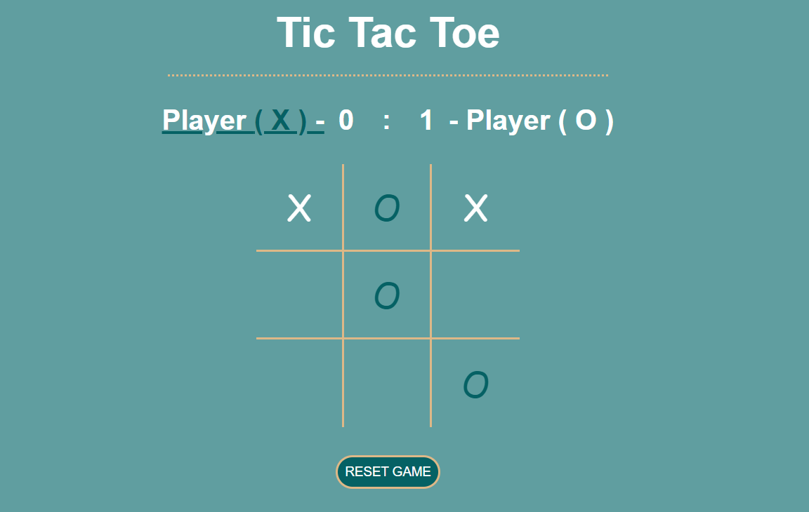

<h2 align="center">
  Welcome to My Tic Tac Toe Game <br/>
  <a href="https://github.com/TihomirDenev/Tic-Tac-Toe" target="_blank">Tic Tac Game</a>
</h2>
<div align="center">
  
</div>

#  Description

- A responsive web-based Tic Tac Toe game that allows two players to play, track scores, and reset the board dynamically. Built using HTML, CSS, and JavaScript, this game includes a clean and interactive interface with real-time score tracking.

#  Technologies Used

- Languages:   

- Browsers:     
  <br/><br/>

#  Features

- **_Two Player Mode:_** Play Tic Tac Toe with another player.
- **_Score Tracking:_** Tracks and displays scores for both players.
- **_Game Board Reset:_** Reset the game board and scores with a single click.
- **_Responsive Design:_** Works well on both desktop and mobile devices.
- **_Visual Feedback:_** Shows modals for game events like win, tie, and restart.

# 🛠 Getting Started

1. Clone the [Tic-Tac-Toe GitHub repository](https://github.com/TihomirDenev/Tic-Tac-Toe) locally:

```bash
git clone https://github.com/TihomirDenev/Tic-Tac-Toe.git
```

2. Navigate to the project directory:

```bash
cd Tic-Tac-Toe
```

3. To run the project, use the following command:

```bash
npm start
```

4. Open localhost link in browser to view web-platform.

# 🗜 Usage

- **_Playing the Game:_** Click on the cells of the game board to make a move.
- **_Restarting the Game:_** Click the "RESET GAME" button to reset the board and scores.
- **_Score Display:_** Scores are displayed for both players at the top of the screen.

# 📋 Code Structure

- **_index.html:_** The main HTML file for the game layout.
- **_styles.css:_** Contains styles and layout for the game.
- **_game-engine.js:_** Contains the main logic for managing the game.
- **_board.js:_** Manages the game board state and rendering.
- **_player.js:_** Manages player properties and scores.
- **_constants.js:_** Contains constant values used throughout the application.

# 🎮 Contributing

- Feel free to fork this repository and make a pull request if you have any improvements or bug fixes.

# ⚖ License

- This project is licensed under the [MIT License](https://opensource.org/licenses/MIT).
